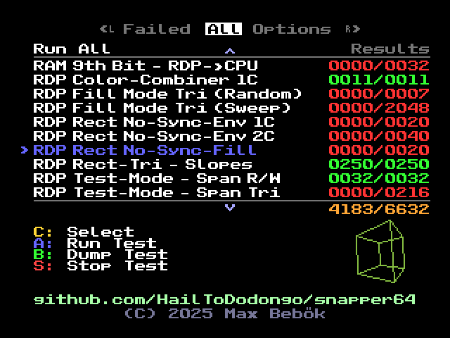
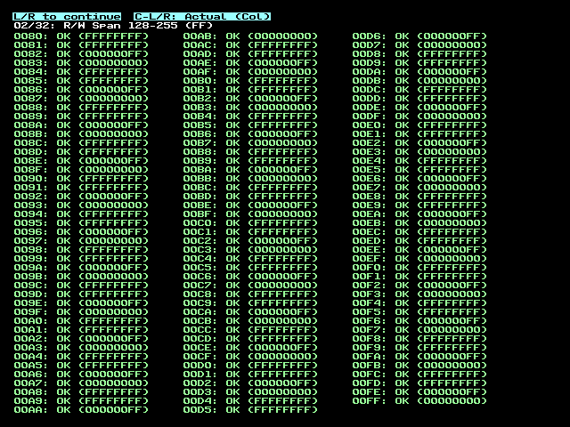
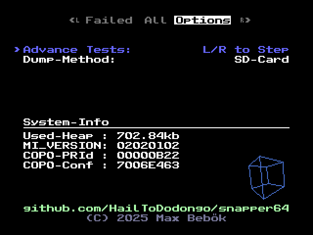

# Snapper64
Self-testing, self-contained, snapshot based RDP test-ROM for the N64.<br>

<br>


# Usage

Get the latest ROM from the releases page, and start it in your emulator or on console.<br>
To run all tests, just press `A` in the menu.<br>
Once finished, you can view the individual and total results in the menu.<br>

In the menu you can also select individual tests to run using the `C-Up` and `C-Down` buttons.<br>
If you do so, it will save the selected test in SRAM, so the next time you boot the ROM, it will automatically be on that test.<br>

While running a test, you can press `Start` to abort and return to the menu.<br>

## Settings

By pressing `L/R` you can toggle into the options tab.<br>
Here you can change the following settings:



- Advance-Tests: either auto-run through all tests in a group, or manually advance.
- Dump-Method: when dumping tests, choose between SD-Card or USB-Log / ISViewer.

Settings chosen here are also saved.

## Inspecting Tests and Errors

When a test fails, you may want to inspect the exact differences.<br>
For that first enable the `L/R to Step` option in the settings.<br>
Then go to the test and start it as usual with `A`.<br>

You will now see a different screen and stay on a test:


Pressing `L` or `R` will go to the previous or next test.<br>
Holding `Z` will quickly advance the tests.<br>
The small letters above the rectangle containing the test shows the internal name of the dumped file.<br>

The way buffers are shown on screen can be changed in this mode by pressing `C-Left` or `C-Right`.<br>
Available modes are:
- Actual (Col)
- Diff (Col)
- Ref (Col)
- Actual (CVG)
- Diff (CVG)
- Ref (CVG)

As the names suggest, this lets you view the drawn image, a diff-view, or the reference image.<br>
Both with either color or coverage values.

While in diff view, wrong pixels are highlighted in white and red, whereas black pixels are correct.<br>
- White: reference pixel was black, drawn pixel is not (suggest extra pixels drawn)
- Red: all other wrong pixel (suggest missing/wrong pixels)

# Building

Make sure you have the [libdragon SDK](https://github.com/DragonMinded/libdragon) setup, using the latest `preview` branch.<br>
You also need 7zip installed, and the `7z` command available.<br>

After that, checkout this repo and run make, ideally with multiple jobs:
```bash
make -j10
```

Note that the initial build can take a long time, due to heavy use of compression for the test assets.<br>
Subsequent builds will be much faster, as only changed assets will be recompressed.<br>

For context: the raw uncompressed files at the time of writing are around 682MB, while the final ROM is around 4.5MB.<br>
The repo stores those as `.7z`, but in order to be usable they need to be recompressed during the build.<br>
On my laptop with an `AMD Ryzen 7 7435HS` at `-j10`, this can take ~40min.

Once the build has finished, a ROM named `snapper64.z64` will be created in the root of the repo.<br>

# Writing Tests

Adding tests is fairly easy, each entry you see in the menu is its own file in the `src/tests/` folder.<br>
Which internally is called a test-group, each group can then contain any number of tests,<br> and each test any amount of assertions.<br>

Individual tests are isolated and cannot, and should not, depend on any other state.<br>
This means for a simple RDP test, it may allocate a surface to draw to, set up the entire RDP state, and check the results.<br>

The way it works on a technical level is that a file first specifies the structure of a test-group,<br>
where each test is a name + `std::function` that can be registered using a lambda-function.<br>
The menu can then display each group, and when started running the callbacks in any order or pacing it wants.<br>

Registering files is also handled in the makefile, so all files in `src/tests/` are picked up automatically.<br>
Note that the namespace in the file must match the filename 1:1.<br>

As a simple example that draws random triangles: (`RDPUndefShade1C.cpp`)
```c++
namespace Tests::RDPUndefShade1C // <- must be same as filename
{
  TestGroup create() // <- called once during startup to register tests
  {
    TestGroup group{"RDP Undefined Shade 1C"}; // <- name shown in menu

    for(int i=0; i<64; ++i)
    {
      // add any amount of tests, if external counters are needed they must be captured
      // in the lambda by value
      group.test("Random " + std::to_string(i), [i](Assert& assert)
      {
        RNG::setSeed(i * 0x1234 + 0x5678); // fixed RNG function if tests need reproducible randomness
        TestSurface surf{FMT_RGBA32, 128, 128}; // Allocate surface for testing
        surf.attachAndClear({0x22, 0x22, 0x22, 0x00}); // use for future RDP draws

        std::array<RDP::Vertex, 3> vtx{};
        for(auto &v : vtx) {
          v.pos = RNG::randVec2Signed() * (surf.getHalfSize()*1.5f) + surf.getHalfSize();
        }

        // helper to create a buffer of RDP commands, then add RDP commands
        RDP::DPL{16}.add(RDP::setOtherModes(OTHER_MODE))
          .add(RDP::setCC(RDPQ_COMBINER1((0,0,0,SHADE), (0,0,0,1))))
          .add(RDP::triangle(0, vtx))
          .runSync(); // <- run and spin-wait the CPU until the RDP is done

        assert.surface(surf); // <- assertion if it matches the reference
        surf.draw(32, 48); // <- optional (but recommended) draw to screen for visual inspection
      });
    }

    return group;
  }
}
```

One thing of note is that tests are fully independent of the actual framebuffer.<br>
Each allocates its own one-time surfaces.<br>
Both testing against the reference, and dumping in dumping mode, is handled by `assert.surface(surf)`.<br>

The assertion knows the current context, which consists of group name and test name,<br>
as well as the current number of assertions run in that test.<br>
Together they form a unique identifier for the reference files to use.<br>

This also means group-names must be unique, as well as test-names within a group.<br>

The easiest to add new tests is to just copy an existing tests closest to what you want to do.<br> 

## Dumping References

After creating or updating tests, you will have to dump the references files.<br>
This step requires you have to an actual N64 console, as well as a flashcard capable of writing to an SD-Card or USB-Logging.<br>
My recommended setup is a [SummerCart64](https://summercart64.dev/) (SC64) and dumping over USB-Log.<br>
The steps explained here also assume a SC64.<br>

Either way, load the ROM as usual and instead of starting a test with `A`, press `B`.<br>

### USB-Log

With your SC64 connected to your PC, capture the logging into a file: (The `test.txt` is ignored by git)
```sh
sc64deployer debug > test.txt
```
After that, start the test with `B`.<br>
Once finished stop the command (e.g. `CTRL+C`).<br>

The `test.txt` should now contain a bunch of line like so:
```
[Debug]: Started
$FILE=2A1ADF69_D1E50CBB_01.test
$DATA=AAAAAAAAAPgDA...
$FILE=2A1ADF69_D1E50CBB_02.test
$DATA=AAAAAAAAAPgDA...
...
```
Finally, run the provided tool to extract the files:
```sh
./tools/data_converter test.txt assets
```
This will extract and place the compressed .7z files into the `assets` folder.<br>
Those can then be checked into git.<br>

All steps after that are handled in the makefile automatically during the next build.<br>
Once the next build is done, it is a good idea to run those tests again on console to verify the dumped references are correct.<br>

### SD-Card
It is also possible to dump files onto the SD-Card.<br>
Note that this is overall slower, and sometimes the ROM can hangup if access takes too long.<br>

With the SD-Card option selected in the menu, start the test with `B`.<br>
Once finished, all files will be placed in the `SD:/tests` directory.<br>

If you connect your SC64 afterward via USB, you can dump them using:
```sh 
./tools/sc64_copy_sd.sh
```

Alternatively, extract them manually and manually compress them individually with 7zip into the `assets` folder.<br>

## Credits & License
© 2025 - Max Bebök (HailToDodongo)<br>

Snapper64 is licensed under the MIT License, see the [LICENSE](LICENSE) file for more information.<br>
